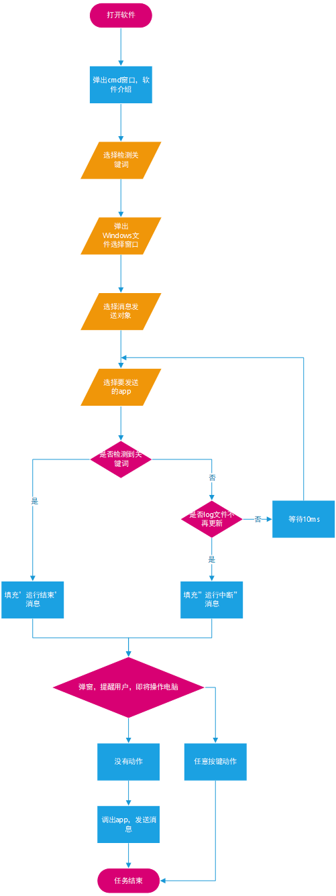
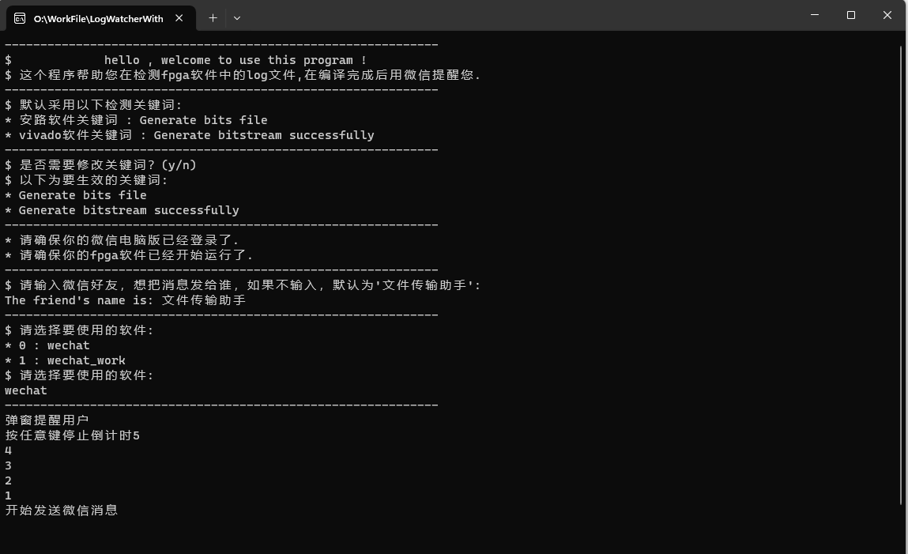

# LogWatcherWithWechat

## 软件使用流程图



## 软件界面



## 开发人员使用指南

```python
pipenv shell #创建pipenv环境
pipenv install -r requirements.txt #还原本工程pipenv环境
pipenv list #查询库是否安装成功
python LogWatcherWithWechat.py #运行程序 
```

