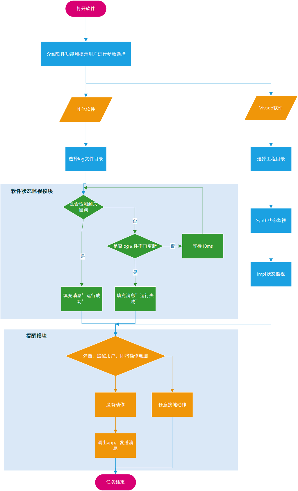
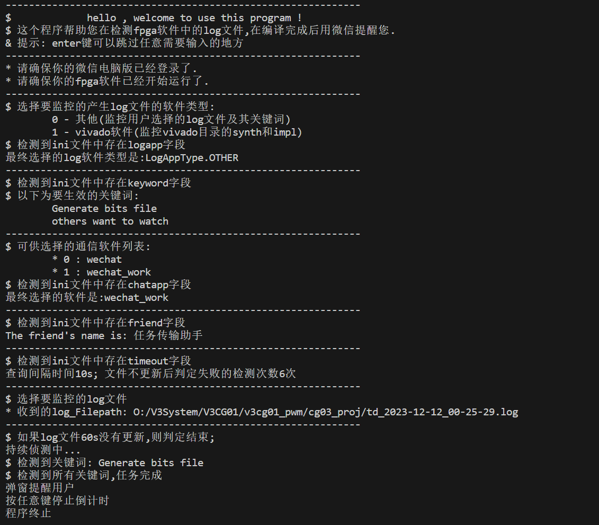

# LogWatcherWithWechat

## 功能介绍
- PFGA软件普遍编译时间长,故而做了一个提醒小软件，当编译结束时进行提醒
- 支持vivado软件，安路fpga软件及其他的log，当检测到关键词时结束，并可选择微信或企业微信提醒
- 支持ini文件或命令行提示词来输入参数
  - 支持自定义检测关键词
  - 支持wechat，wechat_work
  - 支持发送给不同的好友
  - 支持超时时间和轮询间隔时间自定义


# "info.ini"文件格式
> 1. 文件编码gb2312
> 2. ini文件可有可无，没有文件或输入的参数命令行会提示输入
> 3. keyword是logapp选择others时的关键词，最多设置10个
```ini
[info]
logapp = 0 
; 0 - 其他(监控用户选择的log文件及其关键词) 1 - vivado软件(监控vivado目录的synth和impl)
chatapp = 0 
; 0 - none, 1 - wechat , 2 - wechat_work
friend = 任务传输助手
timeout = 6
keyword1 = Generate bits file
```

## 软件使用流程图




## 软件界面



## 开发人员使用指南

```python
pipenv shell #创建pipenv环境
pipenv install -r requirements.txt #还原本工程pipenv环境
pipenv list #查询库是否安装成功
python LogWatcherWithWechat.py #运行程序 
pipenv run pyinstaller --onefile --ico=.\doc\LogWatcherWithWechat.ico  LogWatcherWithWechat.py #打包成exe
```

